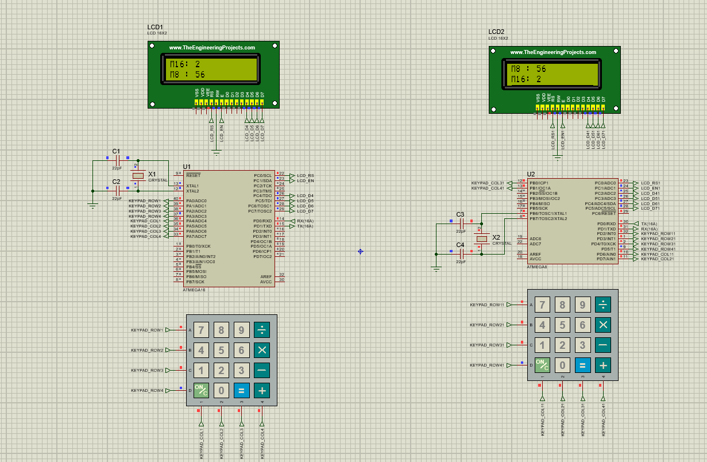

# ATmega16A ↔ ATmega8A UART Communication

## Overview

This project demonstrates **bidirectional UART communication** between an **ATmega16A** and an **ATmega8A** using:

- UART (9600 baud)
- 8 MHz external crystal
- 16×2 LCD on both MCUs
- 4×4 keypad on both MCUs
- Proteus simulation

---

## Proteus Simulation



---

## UART Wiring

```text
ATmega16A                ATmega8A

PD1 (TXD) -----------> PD0 (RXD)
PD0 (RXD) <----------- PD1 (TXD)
GND ------------------ GND
```

---

## How to Test

1. Run the Proteus simulation.
2. Enter a number on the ATmega16A keypad and press **#**.
3. The number appears on the ATmega8A LCD.
4. Enter a number on the ATmega8A keypad and press **#**.
5. The number appears on the ATmega16A LCD.

---

## Video

See the project demonstration video included with this project:

PICTURE/**VIDEO.mp4**

---

## Tools Used

- Atmel Studio 6
- AVR-GCC
- Proteus 8 Professional

---

## Author

Embedded Systems UART Communication Demo
